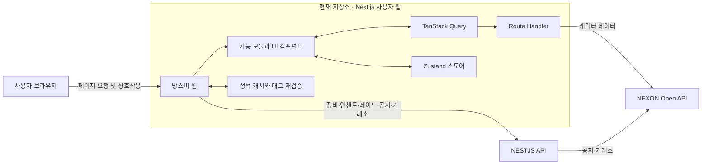
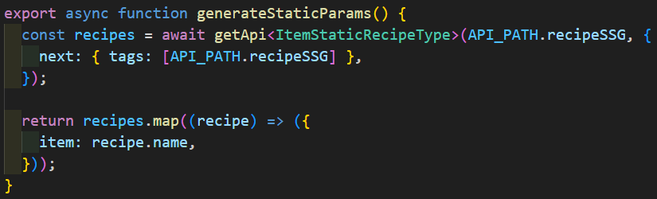

# 망스비 — Next.js 사용자 웹

> 마비노기 영웅전 데이터를 조회하고, 캐릭터의 장비 변경 결과와 전투 입장을 미리 계산할 수 있는 사용자용 웹 애플리케이션입니다.

> GitHub `Heros` 시리즈 중 실제 사용자가 접하는 화면과 상호작용을 담당하는 프로젝트입니다. 이 문서는 시리즈 전체 소개가 아닌, 망스비 웹의 설계와 문제 해결에만 집중합니다.

## 프로젝트 정보

| 항목        | 내용                       |
| ----------- | -------------------------- |
| 프로젝트명  | 망스비                     |
| 서비스 구분 | 사용자 웹                  |
| 참여 인원   | 1인                        |
| 참여 범위   | 모든 기능                  |
| 개발 기간   | 2024.08.17 ~ 2024.09.19    |
| 서비스      | 2024.09.19 ~ 현재          |
| 서비스 URL  | https://www.heroes-dev.com |

## 서비스 소개

게임 정보가 여러 화면과 외부 사이트에 흩어져 있으면 사용자는 캐릭터 상태, 장비 재료, 인챈트 시세, 레이드 입장 기준을 각각 찾아 비교해야 합니다. 망스비는 이러한 탐색 과정을 하나의 웹 서비스로 모으고, 단순 조회를 넘어 장비 변경 이후의 능력치까지 미리 확인할 수 있도록 구성했습니다.

### 주요 기능

- 캐릭터 이름을 통한 기본 정보, 능력치, 길드, 장비 조회
- 장비의 인챈트·정령 합성·연마 조건을 변경하는 세팅 시뮬레이션
- 변경 전후 능력치 비교와 공격력 변화 차트 제공
- 레이드별 빠른 전투 기준 및 상한 능력치 비교
- 장비 제작·승급 재료와 아이템 상세 정보 조회
- 인챈트 효과, 적용 부위, 획득처, 거래 가격 조회
- 골드 거래소 구매·판매 순위와 게임 공지 조회

## 프론트엔드 핵심 구현 경험

### 1. 데이터 성격에 맞춘 서버·클라이언트 요청 분리

변경 빈도가 낮고 여러 사용자에게 공통으로 제공되는 장비, 인챈트, 레이드 데이터는 Server Component에서 서비스 API로 요청합니다. 반면 캐릭터 검색처럼 사용자 입력에 따라 달라지는 데이터는 Next.js Route Handler와 TanStack Query를 통해 조회합니다.

이를 통해 초기 화면에 필요한 공통 데이터는 서버에서 준비하고, 검색 이후의 상호작용은 클라이언트 캐시를 활용하도록 역할을 분리했습니다. 독립적인 여러 요청은 `Promise.all`로 병렬 처리해 불필요한 순차 대기를 줄였습니다.

### 2. 태그 기반 캐시와 요청 시 생성되는 상세 페이지

아이템, 인챈트, 레이드 상세 페이지는 모든 경로를 빌드 시점에 미리 생성하지 않습니다. 처음 들어온 경로를 정적 페이지로 생성한 뒤 캐시하고, 데이터가 변경되면 관리 요청으로 관련 태그만 무효화하도록 구성했습니다.

- `dynamicParams = true`: 빌드 이후 추가된 데이터의 상세 경로도 처리
- `dynamic = 'force-static'`, `revalidate = false`: 최초 요청 결과를 정적 캐시로 유지
- 데이터 요청 경로를 태그로 사용해 목록과 상세 데이터의 무효화 범위를 구분
- 비밀값과 허용된 태그를 함께 검사하는 `/api/revalidate` 엔드포인트 구성

전체 사이트를 다시 빌드하지 않고 변경된 데이터 범위만 갱신할 수 있으며, 새 아이템이나 레이드가 추가되어도 기존 빌드 목록에 없다는 이유로 상세 페이지가 막히지 않습니다.

### 3. 복합 시뮬레이션 상태의 도메인별 분리

장비 미리보기는 인챈트, 연마, 능력치, 선택 레이드 등 여러 상태가 서로 영향을 주는 기능입니다. 이를 하나의 거대한 상태로 관리하지 않고 Zustand 스토어를 도메인 단위로 분리했습니다.

사용자가 장비 옵션을 변경하면 각 스토어의 결과를 조합해 변경 전후 능력치를 계산하고, 표와 Recharts 차트로 시각화합니다. 컴포넌트는 필요한 상태 조각만 구독하도록 구성해 UI 역할과 계산 상태의 책임을 나눴습니다.

### 4. Route Handler를 활용한 외부 API 연동

NEXON Open API 호출은 Axios 인스턴스에 공통 URL과 헤더를 모으고, 캐릭터 기본 정보·장비·길드·능력치·거래소·공지별 Route Handler로 분리했습니다. 캐릭터 조회 엔드포인트에서는 필수 검색 파라미터를 먼저 검증하고, 각 외부 API 응답을 Next.js 응답으로 변환해 화면에 전달합니다.

화면은 NEXON Open API의 실시간 캐릭터 데이터와 서비스 API의 장비·인챈트·레이드 데이터를 조합합니다. 외부 데이터의 출처가 달라도 페이지와 기능 모듈에서는 일관된 타입으로 사용할 수 있도록 요청 위치와 응답 타입을 분리했습니다.

### 5. 동적 콘텐츠를 고려한 SEO 구성

아이템, 인챈트, 레이드 상세 경로마다 콘텐츠에 맞는 title, description, canonical URL을 생성합니다. 또한 서비스 API에서 상세 대상 목록을 가져와 sitemap에 동적 URL을 포함하고, Open Graph, Twitter 메타데이터와 robots 정책을 함께 관리합니다.

## 시스템 구성



## 기술 스택

| 구분          | 기술                             | 활용 내용                                                   |
| ------------- | -------------------------------- | ----------------------------------------------------------- |
| Framework     | Next.js 14 App Router            | Server Component, Route Handler, 정적 캐시, 동적 메타데이터 |
| Language      | TypeScript                       | strict 모드 기반 API 응답 및 컴포넌트 타입 정의             |
| UI            | React 18, Tailwind CSS, Radix UI | 반응형 화면과 재사용 UI 구성                                |
| Server State  | TanStack Query                   | 사용자 검색 데이터 캐시와 요청 상태 관리                    |
| Client State  | Zustand                          | 장비 시뮬레이션과 레이드 선택 상태 분리                     |
| HTTP          | Fetch API, Axios                 | 서비스 API 및 NEXON Open API 연동                           |
| Visualization | Recharts                         | 시뮬레이션 능력치 변화 시각화                               |
| Deployment    | Vercel 설정                      | 정적 이미지 장기 캐시 헤더 적용                             |

## 데이터 흐름

1. 페이지 요청 시 Server Component가 서비스 API에서 공통 데이터를 가져옵니다.
2. 요청 결과에 데이터 종류별 캐시 태그를 부여하고 페이지 렌더링에 사용합니다.
3. 사용자가 캐릭터를 검색하면 TanStack Query가 Next.js 내부 API를 호출합니다.
4. Route Handler가 검색 파라미터를 검증한 뒤 NEXON Open API 결과를 반환합니다.
5. 장비 미리보기에서는 조회 결과와 Zustand의 변경 상태를 조합해 예상 능력치를 계산합니다.
6. 서비스 데이터가 변경되면 인증된 재검증 요청으로 필요한 태그만 무효화합니다.

## 디렉터리 구조

```text
src/
├─ app/
│  ├─ (route)/(main)/       # 사용자 페이지와 상세 동적 경로
│  ├─ api/                  # NEXON API 중계 및 캐시 재검증 엔드포인트
│  ├─ _components/          # 공통 UI와 레이아웃
│  ├─ _features/            # character, preview, raid 등 기능 단위 모듈
│  ├─ _hooks/               # TanStack Query 기반 데이터 조회 훅
│  ├─ _services/            # 외부 API 요청 인스턴스와 서비스 함수
│  ├─ _store/               # Zustand 기반 클라이언트 상태
│  ├─ _type/                # 도메인 및 API 응답 타입
│  └─ _utils/               # 계산, 변환, 조회 유틸리티
└─ components/ui/           # 재사용 UI 컴포넌트
```

## 로컬 실행

### 1. 저장소 설치

```bash
git clone https://github.com/Winter100/Heros.git
cd Heros
npm install
```

### 2. 환경 변수 설정

프로젝트 루트의 `.env`에 다음 값을 설정합니다. 실제 키와 비밀값은 저장소에 커밋하지 않습니다.

```dotenv
BACKEND_URL=
NEXT_PUBLIC_API_KEY=
MY_REVALIDATE_SECRET=
NEXT_PUBLIC_GA_ID=
NEXT_PUBLIC_GOOGLE_CID=
```

| 환경 변수                | 용도                                                   |
| ------------------------ | ------------------------------------------------------ |
| `BACKEND_URL`            | 장비, 인챈트, 레이드 데이터를 제공하는 서비스 API 주소 |
| `NEXT_PUBLIC_API_KEY`    | NEXON Open API 요청 키                                 |
| `MY_REVALIDATE_SECRET`   | 캐시 태그 재검증 요청 인증값                           |
| `NEXT_PUBLIC_GA_ID`      | Google Analytics 측정 ID (선택)                        |
| `NEXT_PUBLIC_GOOGLE_CID` | Google AdSense 게시자 ID (선택)                        |

> 이 저장소에는 외부 서비스의 서버 구현이 포함되어 있지 않습니다. 주요 화면을 정상적으로 실행하려면 연결 가능한 서비스 API와 NEXON Open API 키가 필요합니다.

### 3. 실행 및 확인

```bash
npm run dev
```

브라우저에서 `http://localhost:3000`으로 접속합니다.

```bash
npm run lint          # Next.js ESLint 검사
npx tsc --noEmit    # TypeScript 타입 검사
npm run build       # 프로덕션 빌드
npm run start       # 프로덕션 서버 실행
```

## 화면 자료

### 1. Pc 및 Mobile 이미지


### 2. 캐릭터 조회 및 장비 조회


### 3. 장비 세팅 변경 전후 비교


### 4. 아이템 상세 페이지


### 4. 이미지 검색


## 트러블슈팅 및 성과

### 1. 초기 응답과 검색 노출 개선

#### 문제

- 초기 빠른 응답과 검색 노출 중요도 상승
- 아이템·레이드·인챈트마다 개별 상세 URL이 필요해짐
- 검색 엔진이 각 페이지의 내용을 이해할 수 있어야 함

#### 해결

- `generateStaticParams` 를 이용해 정적 경로 미리 생성
  

- 메타데이터·Canonical·사이트맵을 함께 구성
  

#### 결과

- 전년 동기 서치 콘솔 기준 최근 3개월 총 노출 변화 : 3,300회 —> 8,600회 (2.6배 상승)


### 2. 신규 데이터 생성 시 404 및 빌드 시간 증가 구조 개선

#### 문제

- `generateStaticParams`와 `dynamicParams = false` 로 인해 311개의 데이터를 빌드 시 모두 생성해야 했음 -> 빌드시간 증가
- `dynamicParams = false` 로 인해 새로운 아이템 추가 불가, 신규 데이터 생성 및 수정 시 404가 됨
- 데이터 갱신을 위해선 새롭게 빌드 해야함

#### 해결

- `generateStaticParams`를 제거하여 빌드시 경로를 미리 받아오지 않게 변경
- `dynamicParams = false` -> `dynamicParams = true` 로 변경하여 새로운 아이템도 요청이 발생되게 변경
- `'force-static'`로 명시적으로 적어 첫 요청 발생 시 아이템 생성
- API 조회에는 태그를 부여해 필요한 데이터만 다시 생성할 수 있는 기반을 마련


#### 결과

##### 빌드시간 단축: 16분 52초 -> 2분 31초 (약 85% 감소)


## 향후 개선 계획

- CI/CD 배포 파이프 라인 일관되게 정리
- 응답시간, 오류 등 대시보드로 시각화
- 키보드 탐색과 스크린 리더 기준으로 주요 사용자 흐름 점검
