# 망스비 — Next.js 사용자 웹

> 마비노기 영웅전 데이터를 조회하고, 캐릭터의 장비 변경 결과와 전투 입장을 미리 계산할 수 있는 사용자용 웹 애플리케이션입니다.

GitHub `Heros` 시리즈 중 사용자가 접하는 화면과 상호작용을 담당하는 프로젝트입니다. 이 문서는 현재 Next.js 사용자 웹의 설계와 문제 해결을 다룹니다.

## 프로젝트 정보

| 항목        | 내용                                        |
| ----------- | ------------------------------------------- |
| 프로젝트명  | 망스비                                      |
| 서비스 구분 | 사용자 웹                                   |
| 참여 인원   | 1인                                         |
| 참여 범위   | 모든 기능                                   |
| 개발 기간   | 2024.08.17 ~ 2024.09.19                     |
| 유지보수    | 2025-04-19 (애드센스), 2026-07-29 (DB, SEO) |
| 서비스 기간 | 2024.09.19 ~ 현재                           |
| 서비스 URL  | https://www.heroes-dev.com                  |

## 서비스 소개

게임 정보가 여러 화면과 외부 사이트에 흩어져 있으면 사용자는 캐릭터 상태, 장비 재료, 인챈트 시세, 레이드 입장 기준을 각각 찾아 비교해야 합니다. 망스비는 이러한 탐색 과정을 하나의 웹 서비스로 모으고, 장비 변경 이후의 능력치까지 미리 확인할 수 있도록 구성했습니다.

### 주요 기능

- 캐릭터 이름을 통한 기본 정보, 능력치, 길드, 장비 조회
- 장비의 인챈트·정령 합성·연마 조건을 변경하는 세팅 시뮬레이션
- 변경 전후 능력치 비교와 공격력 변화 차트 제공
- 레이드별 빠른 전투 기준 및 상한 능력치 비교
- 장비 제작·승급 재료와 아이템 상세 정보 조회
- 인챈트 효과, 적용 부위, 획득처, 거래 가격 조회
- 골드 거래소 구매·판매 순위와 게임 공지 조회
- 이미지 속 캐릭터 이름 인식 및 여러 캐릭터 검색

## 프론트엔드 핵심 구현 경험

### 1. 태그 기반 캐시와 요청 시 생성되는 상세 페이지

아이템, 인챈트, 레이드 상세 페이지는 모든 경로를 빌드 시점에 미리 생성하지 않습니다. 요청이 들어온 경로를 정적 페이지로 생성하고 캐시하도록 구성했습니다.

- `dynamicParams = true` 빌드 이후 추가된 상세 경로도 처리
- `dynamic = 'force-static'`, `revalidate = false` 상세 페이지를 정적 캐시로 유지
- 데이터 요청에 목록·상세별 태그를 등록
- `/api/revalidate`에서 비밀값과 허용 태그를 검사한 뒤 태그 재검증

새 데이터의 상세 경로를 빌드 목록에 미리 포함할 필요가 없습니다. 데이터 변경 시 지정한 태그를 갱신하도록 구성했으며, 실제 태그와 요청 규격은 아래 운영 안내에 명시했습니다. 인챈트 시세 표 조회에는 별도로 12시간 재검증 주기를 설정했습니다.

```ts
// 사용하는 쪽에서 tags 지정해 무효화 할 수 있게 함
const recipe = await getServerDetail<ItemRecipes>(path, {
  next: { tags: [cacheTag] },
});

// getServerDetail
import { notFound } from 'next/navigation';
import { getServerApi } from './getServerApi';
import { ApiError } from './requestApi';

export const getServerDetail = async <T>(
  path: string,
  options?: RequestInit
): Promise<T> => {
  try {
    return await getServerApi<T>(path, options);
  } catch (e: unknown) {
    if (e instanceof ApiError && e.status === 404) {
      notFound();
    }

    throw e;
  }
};
```

구현 근거: [아이템 상세 페이지](<https://github.com/Winter100/Heroes/blob/main/src/app/(route)/(main)/iteminfo/%5Bitem%5D/page.tsx>)

### 2. 복합 시뮬레이션 상태의 도메인별 분리

장비 미리보기의 인챈트, 연마, 능력치, 선택 레이드 상태를 Zustand 스토어로 분리했습니다. 사용자가 옵션을 변경하면 각 상태를 조합해 변경 전후 능력치를 계산하고, 표와 Recharts 차트로 시각화합니다. 컴포넌트는 필요한 상태를 구독하여 화면 구성과 계산 상태의 책임을 나눕니다.

```ts
// 인챈트 시뮬레이션 스토어
export const useEnchantStore = create<EnchantState & EnchantAction>((set) => {
  return {
    simulations: {},
    setSimulations: (
      itemId,
      affix,
      beforeEnchant,
      afterEnchant,
      isExisting
    ) => {
      set((state) => {
        const current = state.simulations[itemId] || {
          prefix: { before: null, after: null },
          suffix: { before: null, after: null },
          infusion: { before: null, after: null },
          partholn: { before: null, after: null },
          grind: { before: null, after: null },
        };

        return {
          simulations: {
            ...state.simulations,
            [itemId]: {
              ...current,
              [affix]: {
                before: { ...beforeEnchant, isExisting },
                after: { ...afterEnchant, isExisting },
              },
            },
          },
        };
      });
    },

    resetSimulations: () => set({ simulations: {} }),
  };
});
```

```ts
// useSimulationStats 를 통해 시뮬레이션 상태 구독
import { useSimulationStats } from '@/app/_hooks';
import PreviewStatsSummaryDialog from './preview-stats-summary-dialog';

const PreviewStatsSummaryContainer = ({ ocid }: { ocid: string }) => {
  const { beforeStats, diffStatsArray, finalStatsArray } =
    useSimulationStats(ocid);

  return (
    <PreviewStatsSummaryDialog
      beforeStats={beforeStats ?? []}
      diffStatsArray={diffStatsArray}
      finalStatsArray={finalStatsArray}
    />
  );
};

export default PreviewStatsSummaryContainer;
```

구현 근거: [인챈트 시뮬레이션 스토어](https://github.com/Winter100/Heroes/blob/main/src/app/_store/useEnchantStore.ts), [시뮬레이션 구독 컴포넌트](https://github.com/Winter100/Heroes/blob/dev/src/app/_features/preview/components/menubar/stats/preview-stats-summary-container.tsx)

### 3. Route Handler와 서버 요청을 활용한 외부 API 연동

NEXON Open API 호출은 Axios 인스턴스에 공통 URL과 헤더를 모았습니다. 캐릭터 기본 정보·장비·길드·능력치 등은 Route Handler로 조회하며, 캐릭터 조회 엔드포인트에서 필수 검색 파라미터를 검증합니다.

화면은 외부 API에서 조회한 캐릭터 데이터와 서비스 API의 장비·인챈트·레이드 데이터를 조합합니다.

```ts
import axios from 'axios';

const BASE = process.env.NEXT_PUBLIC_API_URL as string;
const NEXONE_API_KEY = process.env.NEXON_API_KEY as string;
const game = 'heroes';

const versionV1 = 'v1';
const versionV2 = 'v2';

const baseUrlV1 = `${BASE}/${game}/${versionV1}`;
const baseURLV2 = `${BASE}/${game}/${versionV2}`;

export const nexonInstanceV1 = axios.create({
  baseURL: baseUrlV1,
  method: 'GET',
  headers: {
    'Cache-Control': 'no-cache',
    'x-nxopen-api-key': NEXONE_API_KEY,
  },
});

export const nexonInstance = axios.create({
  baseURL: baseURLV2,
  method: 'GET',
  headers: {
    'Cache-Control': 'no-cache',
    'x-nxopen-api-key': NEXONE_API_KEY,
  },
});
```

구현 근거: [Axios 설정](https://github.com/Winter100/Heroes/blob/main/src/app/_services/nexonInstance.ts), [캐릭터 Route Handler](https://github.com/Winter100/Heroes/blob/main/src/app/api/getCharacterBasic/route.ts)

### 4. 동적 콘텐츠를 고려한 SEO 구성

아이템, 인챈트, 레이드 상세 경로마다 title, description, canonical URL을 생성합니다. 서비스 API에서 목록을 조회해 sitemap에 상세 URL을 포함하고, Open Graph, Twitter 메타데이터와 robots 정책을 함께 관리합니다.

```ts
export async function generateMetadata({ params }: Props): Promise<Metadata> {
  const { item } = await params;
  const itemName = decodeURIComponent(item);
  return {
    title: `${itemName} | ${keyword.project.name} `,
    description: `${itemName} 제작 재료 및 승급 재료와 능력치 정보를 제공합니다.`,
    alternates: {
      canonical: `${baseUrl}/iteminfo/${encodeURIComponent(item)}`,
    },
  };
}
```

구현 근거: [sitemap](https://github.com/Winter100/Heroes/blob/main/src/app/sitemap.ts), [아이템 상세 페이지](<https://github.com/Winter100/Heroes/blob/main/src/app/(route)/(main)/iteminfo/%5Bitem%5D/page.tsx>)

### 6. 실행 환경에 따른 API 요청과 오류 처리

서비스 API 요청은 서버용 `getServerApi`와 브라우저용 `getClientApi`로 분리했습니다. 서버 요청에는 `BACKEND_URL`과 Next.js 캐시 옵션을 사용하고, 브라우저 요청에는 `NEXT_PUBLIC_BACKEND_URL`을 사용합니다. 공통 `requestApi<T>`는 성공 응답을 반환하고, 실패한 HTTP 응답은 상태 코드를 담은 `ApiError`로 전달합니다.

고정 서버 데이터는 `getServerData`의 키와 응답 타입을 연결해 조회합니다. 상세 페이지의 `getServerDetail`은 API가 반환한 404만 `notFound()`로 처리합니다. 네트워크 오류와 서버 오류는 상위 오류 화면으로 전달하여 존재하지 않는 데이터와 조회 실패를 구분합니다.

홈 공지 화면에는 Suspense와 `ClientErrorBoundary`를 적용했습니다. 재시도 시 Error Boundary와 TanStack Query의 오류 상태를 함께 초기화합니다. 이 정책은 해당 공통 함수와 적용 화면을 기준으로 하며, 일부 기존 요청에는 빈 결과로 대체하는 처리가 남아 있습니다.

```ts
// getServerData
export const getServerData = <K extends keyof ServerDataMap>(
  key: K
): Promise<ServerDataMap[K]> => {
  const path = API_PATH[key];

  return getServerApi<ServerDataMap[K]>(path, {
    next: {
      tags: [path],
      ...(key === 'enchantTable' ? { revalidate: 43200 } : {}),
    },
  });
};

// Enchant Page
const Page = async () => {
  const enchants = await getServerData(API_KEY.enchantTable);
  return (
    <div className="mx-auto max-w-7xl gap-6 px-4 py-6 sm:px-6">
      <AdBanner />
      <Suspense fallback={<ItemEnchantTableServer enchants={enchants} />}>
        <EnchantFilterList enchants={enchants} />
      </Suspense>
    </div>
  );
};

export default Page;
```

```ts
// 서스펜스 쿼리
export const useNotice = () => {
  const options = {
    method: 'GET',
    headers: {
      'Content-Type': `application/json`,
    },
  };

  return useSuspenseQuery({
    queryFn: () =>
      getClientApi<{
        notice: NoticeDataType;
        patchNotice: NoticePatchDataType;
        eventNotice: NoticeEventDataType;
      }>(`${API_PATH.notice}`, options),
    queryKey: [API_PATH.notice],
    retry: 1,
  });
};

// 서스펜스를 이용한 홈 컴포넌트 일부분
        <ClientErrorBoundary>
          <Suspense
            fallback={
              <div className="m-2 flex h-[480px] items-center justify-center bg-muted/50 p-2">
                <Loading />
              </div>
            }
          >
            <HomeMainContent />
          </Suspense>
        </ClientErrorBoundary>
```

구현 근거: [홈 메인 컨텐츠](https://github.com/Winter100/Heroes/blob/main/src/app/_features/home/components/HomeMainContent.tsx), [공지사항 커스텀 훅](https://github.com/Winter100/Heroes/blob/main/src/app/_hooks/get/useNotice.ts)

### 5. OCR을 활용한 이미지 속 캐릭터 이름 검색

클립보드 이미지를 읽고 Tesseract.js로 한글·영문 텍스트를 인식합니다. 인식한 이름을 검색 입력값으로 전달해 캐릭터를 조회하고 레이드 기준 비교에 활용합니다. 검색 목록은 최대 8명으로 제한하며, 사용자가 인식 결과를 확인하고 수정할 수 있습니다.

클립보드 이미지 읽기는 HTTPS 또는 localhost에서 브라우저의 지원 및 권한이 필요합니다.

```ts
export const imageToName = async (img: string | File | Buffer) => {
  if (!img) return;

  try {
    const result = await Tesseract.recognize(img, 'kor+eng', {
      logger: (m) => {
        if (m.status === 'recognizing text') {
        }
      },
    });

    const text = result.data.text;
    return text.split('\n').filter(Boolean) ?? [];
  } catch (e) {
    console.error(e);
  }
};
```

구현 근거: [이미지 서치 커스텀 훅](https://github.com/Winter100/Heroes/blob/main/src/app/_hooks/custom/useImageSearch.ts), [imageToName 함수](https://github.com/Winter100/Heroes/blob/main/src/app/_utils/get/get-util.ts)

## 시스템 구성

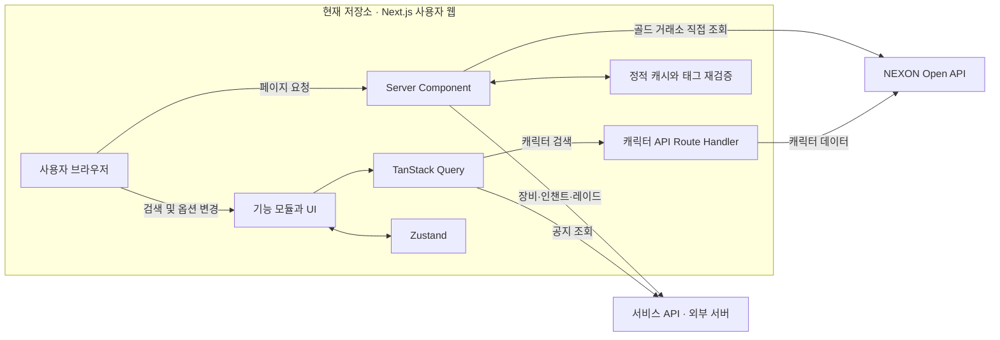

서비스 API의 서버 구현은 이 저장소에 포함되어 있지 않습니다. 구성도는 현재 프론트엔드에서 확인되는 호출 관계를 나타냅니다.

## 기술 스택

| 구분           | 기술                             | 활용 내용                                                   |
| -------------- | -------------------------------- | ----------------------------------------------------------- |
| Framework      | Next.js 14.2.13 App Router       | Server Component, Route Handler, 정적 캐시, 동적 메타데이터 |
| Language       | TypeScript                       | strict 모드 기반 API 응답 및 컴포넌트 타입                  |
| UI             | React 18, Tailwind CSS, Radix UI | 반응형 화면과 재사용 UI                                     |
| Server State   | TanStack Query                   | 검색·공지 데이터 캐시와 요청 상태                           |
| Client State   | Zustand                          | 시뮬레이션과 레이드 선택 상태                               |
| HTTP           | Fetch API, Axios                 | 서비스 API 및 NEXON Open API 연동                           |
| Visualization  | Recharts                         | 능력치 변화 시각화                                          |
| OCR            | Tesseract.js                     | 이미지 속 한글·영문 인식                                    |
| Error Handling | react-error-boundary             | 홈 공지 오류 화면과 재시도                                  |
| Deployment     | Vercel 설정                      | `/images/*` 장기 캐시 헤더                                  |

## 데이터 흐름

1. Server Component가 서비스 API에서 공통 데이터를 가져옵니다.
2. 서버 조회 결과에 캐시 태그를 부여하고 페이지 렌더링에 사용합니다.
3. 캐릭터 검색 시 TanStack Query가 Next.js 내부 API를 호출합니다.
4. Route Handler가 파라미터를 검증하고 NEXON Open API 결과를 반환합니다.
5. 장비 미리보기에서 조회 결과와 Zustand 상태를 조합해 예상 능력치를 계산합니다.
6. 공지는 브라우저에서 서비스 API로, 골드 거래소는 Next.js 서버에서 NEXON Open API로 직접 요청합니다.
7. 데이터 변경 시 인증된 요청으로 지정한 서버 캐시 태그를 재검증합니다.

## 디렉터리 구조

```text
src/
├─ app/
│  ├─ (route)/(main)/       # 사용자 페이지와 상세 동적 경로
│  ├─ api/                 # API 중계, 서버·클라이언트 요청 함수, 재검증
│  ├─ _components/         # 공통 UI, 오류 화면, 레이아웃
│  ├─ _constant/           # API 경로와 도메인 상수
│  ├─ _features/           # character, preview, raid 등 기능 모듈
│  ├─ _hooks/              # 조회 및 사용자 상호작용 훅
│  ├─ _provider/           # TanStack Query 등 Provider
│  ├─ _services/           # 외부 API 요청 인스턴스와 서비스 함수
│  ├─ _store/              # Zustand 상태
│  ├─ _type/               # 도메인 및 API 응답 타입
│  ├─ _utils/              # 계산, 변환, OCR 유틸리티
│  ├─ sitemap.ts           # 정적·상세 URL 목록
│  └─ robots.ts            # 크롤링 정책
└─ components/ui/          # 재사용 UI 컴포넌트
```

## 로컬 실행

### 1. 저장소 설치

```bash
git clone https://github.com/Winter100/Heros.git
cd Heros
npm install
```

### 2. 환경 변수 설정

프로젝트 루트의 `.env`에 다음 값을 설정합니다.

```dotenv
BACKEND_URL=
NEXT_PUBLIC_BACKEND_URL=
NEXT_PUBLIC_FRONT_BASE_URL=
NEXT_PUBLIC_API_KEY=
MY_REVALIDATE_SECRET=
NEXT_PUBLIC_GA_ID=
NEXT_PUBLIC_GOOGLE_CID=
```

| 환경 변수                    | 용도 및 입력 방법                                                                                          |
| ---------------------------- | ---------------------------------------------------------------------------------------------------------- |
| `BACKEND_URL`                | Next.js 서버가 접근할 서비스 API 기본 주소. 끝의 `/` 제외                                                  |
| `NEXT_PUBLIC_BACKEND_URL`    | 브라우저에서 접근할 서비스 API 기본 주소. 현재 공지 조회에 사용. 끝의 `/` 제외                             |
| `NEXT_PUBLIC_FRONT_BASE_URL` | sitemap·canonical에 사용할 웹 주소. 로컬은 `http://localhost:3000`, 운영은 실제 서비스 주소. 끝의 `/` 제외 |
| `NEXT_PUBLIC_API_KEY`        | 본인에게 발급된 NEXON Open API 키                                                                          |
| `MY_REVALIDATE_SECRET`       | 재검증을 호출하는 서버와 동일하게 설정한 비밀값                                                            |
| `NEXT_PUBLIC_GA_ID`          | Analytics 사용 시 실제 측정 ID 입력                                                                        |
| `NEXT_PUBLIC_GOOGLE_CID`     | AdSense 사용 시 게시자 ID의 숫자 부분 입력. 코드에서 `ca-pub-`를 붙임                                      |

이 저장소에는 외부 서비스의 서버 구현이 포함되어 있지 않습니다. 주요 화면과 빌드 중 데이터 조회를 실행하려면 접근 가능한 서비스 API와 NEXON Open API 키가 필요합니다.

### 3. 실행 및 확인

```bash
npm run dev
```

브라우저에서 `http://localhost:3000`으로 접속합니다.

```bash
npm run lint        # ESLint 검사
npx tsc --noEmit    # TypeScript 타입 검사
npm run build      # 프로덕션 빌드
npm run start      # 성공한 빌드 이후 프로덕션 서버 실행
```

## 캐시 재검증 운영 안내

`POST /api/revalidate`는 쿼리 문자열의 `tag`와 요청 헤더의 `revalidate-secret`을 받습니다. JSON 본문의 태그를 읽는 방식은 아닙니다.

| 항목   | 규격                                                                     |
| ------ | ------------------------------------------------------------------------ |
| 메서드 | `POST`                                                                   |
| 쿼리   | `tag`: 조회 시 등록한 캐시 태그                                          |
| 헤더   | `revalidate-secret`: `MY_REVALIDATE_SECRET`과 동일한 값                  |
| 성공   | `200`, `{ revalidated: true, tag, now }`                                 |
| 실패   | 비밀값 불일치·허용되지 않은 태그 `401`, 태그 누락 `400`, 처리 오류 `500` |

목록·상세·사이트맵 조회의 태그는 서로 다릅니다. 상세 태그는 URL 디코딩한 이름을 사용하며, 요청 쿼리를 만들 때 전체 태그를 인코딩해야 합니다.

| 데이터                              | 조회 시 사용하는 태그              | 현재 재검증 API 허용 여부 |
| ----------------------------------- | ---------------------------------- | ------------------------- |
| 아이템 목록 및 사이트맵 아이템 목록 | `/items/recipe`                    | 허용                      |
| 아이템 상세                         | `/items/recipe/name/{아이템 이름}` | 허용                      |
| 인챈트 목록                         | `/enchants?category=ENCHANT`       | 허용                      |
| 인챈트 시세 표                      | `/enchants/table`                  | 허용                      |
| 인챈트 상세                         | `/enchants/name/{인챈트 이름}`     | 허용                      |
| 사이트맵 인챈트 목록                | `/enchants/ssg`                    | 허용                      |
| 레이드 목록                         | `/raids/table`                     | 허용                      |
| 레이드 상세                         | `/raids/name/{레이드 이름}`        | 허용                      |
| 사이트맵 레이드 목록                | `/raids/ssg`                       | 허용                      |

## 화면 자료

### 1. PC 및 Mobile 이미지

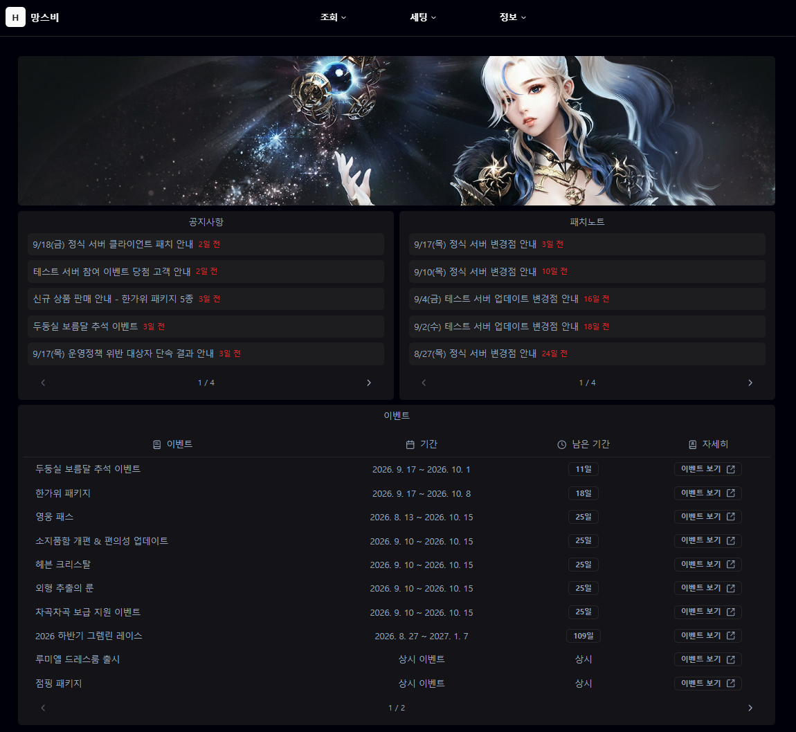
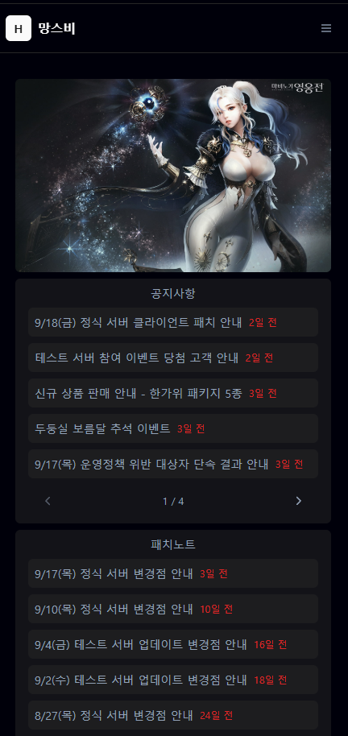

### 2. 캐릭터 조회 및 장비 조회

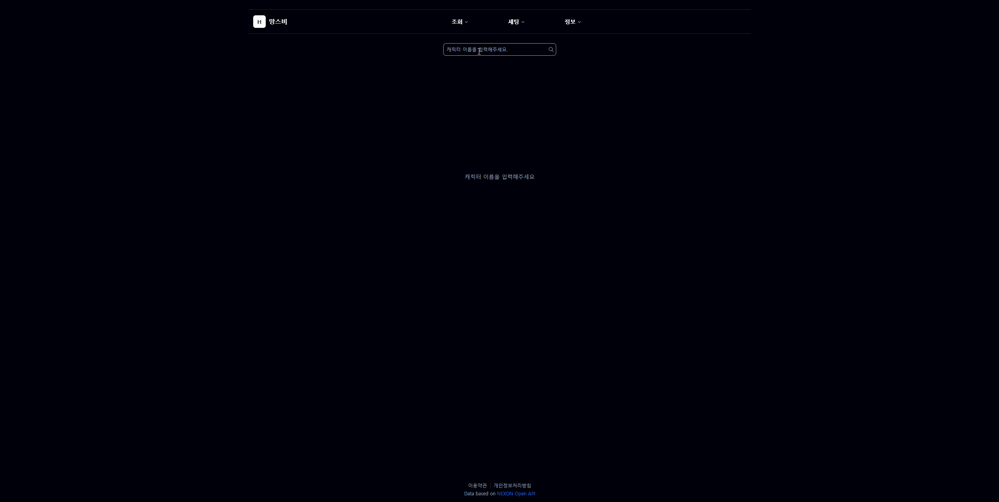

### 3. 장비 세팅 변경 전후 비교

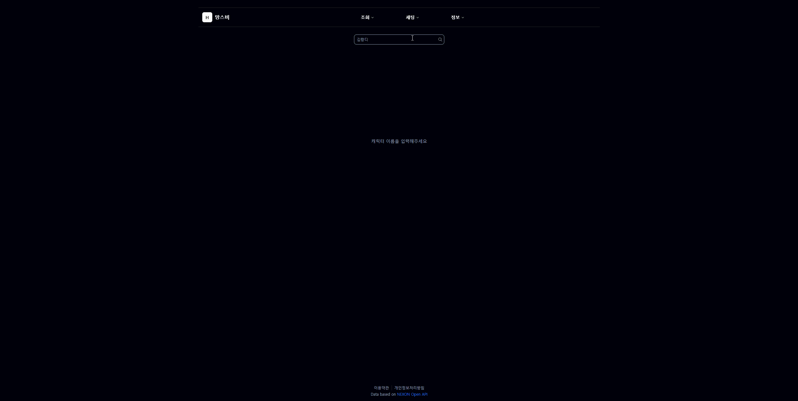

### 4. 아이템 상세 페이지

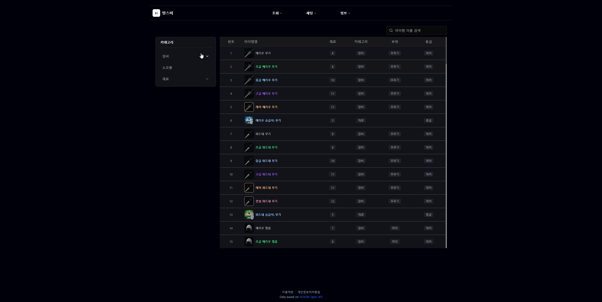

### 5. 이미지 속 캐릭터 이름 인식 및 검색


## 트러블슈팅 및 성과

### 1. 초기 상세 페이지 및 검색 노출 개선

#### 문제

아이템·레이드·인챈트별 상세 URL과 검색 엔진이 이해할 수 있는 페이지 정보가 필요했습니다.

#### 해결

- 초기 구현 당시에는 `generateStaticParams`로 정적 경로를 미리 생성했습니다. 현재는 다음 사례의 요청 시 생성 방식으로 변경했습니다.
- 메타데이터, canonical, sitemap을 함께 구성했습니다.

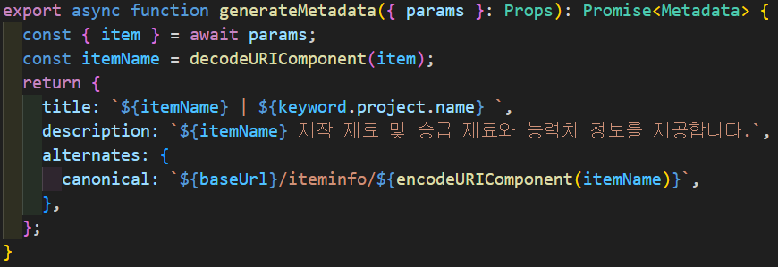

#### 결과 및 측정 조건

총 노출 수

- 개선 전 `2700`회 -> 개선 후 `7500` 회 (노출 약 2.7배 상승)

측정 기간

- `26.07.29 SEO 관련 유지 보수 적용`
- `2025.07.29 ~ 2025.09.30` ~ `2026.07.29 ~ 2026.09.30`

측정 범위

- `Google Search Console 웹 Text`

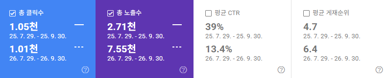

### 2. 신규 상세 경로의 404와 빌드 시 생성 부담 개선

#### 문제

- 초기 구조는 `generateStaticParams`로 상세 경로를 빌드 시 생성했습니다.
- `dynamicParams = false`로 인해 빌드 시 생성하지 않은 신규 상세 경로가 404로 처리되었습니다.
- 기존 상세 데이터의 수정에는 캐시 갱신 절차가 필요했습니다.

#### 해결

- `generateStaticParams`를 제거해 상세 경로를 빌드 시 미리 생성하지 않도록 변경했습니다.
- `dynamicParams = true`로 신규 상세 경로를 처리하도록 변경했습니다.
- `force-static`과 `revalidate = false`로 요청 시 생성한 상세 페이지를 캐시하도록 구성했습니다.
- 데이터 조회에 태그를 부여하고 인증된 재검증 요청으로 필요한 태그를 갱신하도록 구성했습니다.

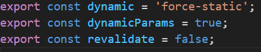
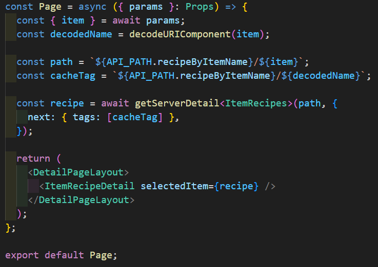

#### 결과 및 측정 조건

`16분 52초 → 2분 31초`

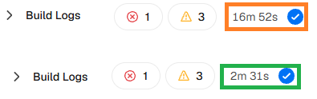

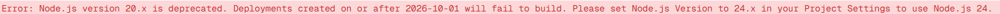

- 빌드 경고는 26.10.01 부터 Node 24v 을 사용해야 빌드 할 수 있다는 경고 입니다.

## 향후 개선 계획

- 기존 요청의 빈 결과 대체 처리를 점검하고 오류 정책 정리
- CI/CD 배포 파이프라인 정리
- 키보드 탐색과 스크린 리더 기준으로 주요 흐름 점검
